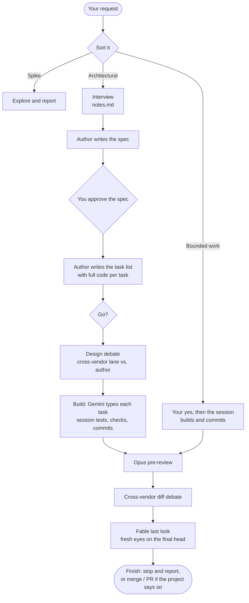

<div align="center">

# parsec

**Design, build and cross-vendor review for Claude Code, in one lean plugin.**

An Opus author writes the plan. A fast Gemini lane types the code. Models from three different companies check the work at the moments where a mistake gets expensive.


[](https://github.com/Bmwascher/parsec/actions/workflows/checks.yml)

</div>

---

## Contents

- [What it is](#what-it-is)
- [Why it exists](#why-it-exists)
- [How a feature moves through it](#how-a-feature-moves-through-it)
- [Who does what](#who-does-what)
- [Install](#install)
- [Set up a project](#set-up-a-project)
- [Everyday use](#everyday-use)
- [How a review works](#how-a-review-works)
- [What it writes to disk](#what-it-writes-to-disk)
- [The tool](#the-tool)
- [Safety rails](#safety-rails)
- [Working on parsec itself](#working-on-parsec-itself)
- [Repository layout](#repository-layout)

---

## What it is

parsec is a [Claude Code](https://claude.com/claude-code) plugin that takes a feature from a rough idea to reviewed, committed code. It does three things:

1. **Design.** It interviews you, then has an Opus author write a spec and a step-by-step task list with the real code in every step.
2. **Build.** A Gemini lane copies each task into the codebase. The session runs the tests, checks the diff and makes the commit.
3. **Review.** At each point where you are about to commit to something, a model from a *different company* reads the work cold and argues with it until the findings are settled.

Five skills carry the rules, and one Python file (`tools/parsec.py`) does the mechanical work: packaging review rounds, launching the other companies' command-line tools, and recording every verdict.

> [!NOTE]
> parsec replaces two earlier plugins, superpowers and parallax. It keeps what those did well and drops the rest. The guiding rule of the rebuild: *prefer deleting to simplifying, because a simplified component is still a component.*

---

## Why it exists

A model that reviews its own work tends to agree with itself. A model from another vendor was trained differently, so it misses different things and catches different things. parsec puts that second opinion exactly where it pays off:

- **before building**, when a flaw in the plan is cheap to fix;
- **after building**, when a flaw in the diff has not reached the main branch yet.

It also splits *thinking* from *typing*. The expensive model decides everything and writes the code into the plan. A cheap, fast model only transcribes it. When a transcription goes wrong, the tool can tell, and the task moves to a stronger seat.

---

## How a feature moves through it

Every request is sorted first. It can only ever get heavier, never lighter.

| Kind | What it is | What happens |
|---|---|---|
| **Spike** | Exploration with nothing to keep | No folder, no spec, no review. You hear what was learned. |
| **Bounded work** | A fix, a rename, a guard: small enough to need no design | Your "yes" is the go. The session builds and commits it, then runs the review gate. |
| **Architectural** | Everything else | The full flow below. |



**The one hard stop is the go.** Nothing is built until you say it, and approving the spec is not the same as a go. A pre-approved handoff counts as one.

**The finish is "stop and report"** unless you, the handoff or the project's own rules say to merge or open a pull request. The report lists every open minor finding, every point the driver refuted, and every round closed early, so nothing decided on your behalf is silently dropped.

---

## Who does what

A **seat** is a job. A **lane** is a model the tool launches from the command line. Seats inside Claude Code are agents; their model lives in the agent file. Lanes live in [`lanes.toml`](lanes.toml).

| Seat or lane | Model | Job |
|---|---|---|
| `author` | Claude Opus 5.5, high effort | Writes the spec and task list; answers design findings with an edit or cited evidence |
| **Gemini lane** | Gemini 3.8 Flash (via `agy`) | Types each task exactly as written. Decides nothing. |
| `implementer` | Claude Opus 5.5, medium effort | Builds what Gemini can't: deletes, renames, moves, and any task Gemini got wrong once |
| `reviewer-opus` | Claude Opus 5.5, high effort | The pre-review at the start of the diff gate |
| **Sol lane** (default) | GPT-6 Sol (via `codex`) | The cross-vendor reviewer for design and diff debates |
| **Astra lane** | GPT-6 Astra (via `codex`) | The alternate cross-vendor reviewer, used by name |
| **Kimi lane** | Kimi K3 (via `kimi`) | The backup reviewer, used only with your approval (or the config's standing approval) |
| `reviewer-fable` | Claude Fable 5.1, high effort | The last look, panel seats, polls, and tie-breaking advice |
| Driver | Whatever model your session runs | Runs the flow, checks every claim, makes every commit |

> [!TIP]
> Model notes in [`models/`](models/) record what each model and CLI actually does, each fact dated or marked UNMEASURED. Swapping a model means re-deciding its effort level from that model's own guide, because "high" doesn't mean the same amount of thinking across vendors.

---

## Install

### What you need

| Tool | Why | Required? |
|---|---|---|
| [Claude Code](https://claude.com/claude-code) | Hosts the plugin | Yes |
| Python 3.12 | Runs `tools/parsec.py` | Yes |
| Git | Worktrees, diffs, commits | Yes |
| PowerShell 7 | Every shell step (never Windows PowerShell 5.1) | Yes, on Windows |
| `codex` CLI, logged in | The Sol and Astra lanes | Yes, for cross-vendor review |
| `agy` CLI, logged in | The Gemini build lane | No. Without it, every task goes to the Opus `implementer`. |
| `kimi` CLI, logged in | The Kimi backup lane | No |

### Add the plugin

From a terminal:

```powershell
claude plugin marketplace add Bmwascher/parsec
claude plugin install parsec@parsec
```

The repository is private, so this needs git access to it (a logged-in `gh` or saved git credentials). To install from a local clone instead, give the folder path:

```powershell
claude plugin marketplace add C:\Users\Brandon\Documents\parsec
claude plugin install parsec@parsec
```

Restart Claude Code afterwards so the skills load.

### Check it

```text
/parsec:doctor
```

A healthy result looks like this:

```text
plugin install: 0.1.4 at a91223d4: ok
lane astra: gpt-6-astra effort high   codex-cli 0.156.0   Logged in using ChatGPT
lane sol: gpt-6-sol effort high   codex-cli 0.156.0   Logged in using ChatGPT
lane kimi: kimi-code/k3 effort lane home   0.43.1   credentials present in the lane home
lane gemini: gemini-3.8-flash-high effort the model   1.2.5   login: the first run's log
```

The first line compares the installed copy with the repository head. If it says anything but `ok`, the plugin cache is stale (see [Releasing](#releasing)).

`/parsec:doctor update` runs each CLI's own update command once and names every lane it serves.

---

## Set up a project

Each project answers once. Say **"set up parsec"** (or run any parsec step; the tool will say *run setup first*).

The `setup` skill scans the repository, then shows **one proposed config** with the evidence behind every guess. You correct it by exception. Nothing is written until you confirm.

The config lives in the **primary checkout** at `.claude/parsec.toml` and is always read from there, never from a worktree's stale copy. Only two keys are required:

```toml
# .claude/parsec.toml
docs_root = "dev/docs/parsec"                                # where feature folders go
worktrees = "C:/Users/Brandon/Documents/KitnDev/_worktrees"  # where worktrees go

[reviewer]                       # optional; these are the defaults
codex_lane        = "sol"        # or "astra"
kimi_substitution = "ask"        # or "approved"

[[context]]                      # the reviewer's rubric, read first
path     = "AGENTS.md"
role     = "rubric"
sections = ["Performance", "Verification"]

[[context]]                      # look up and cite, never required reading
path = ".wow-api-reference"
role = "lookup"

[[context]]                      # reference code, named per round
path = "References"
role = "reference-code"
```

> [!IMPORTANT]
> The config holds only what the tool reads as data. Your project's gates, test policy, commit style, merge rules and smoke checks stay as prose in the project's own `AGENTS.md` or `CLAUDE.md`. **The project's rules always outrank parsec's.**

Run setup again after moving the project folder or resetting the PC, since absolute paths may change.

---

## Everyday use

You talk to it in plain words. The skills trigger on what you say.

| You say | What runs |
|---|---|
| "Design a keybind export feature" / "brainstorm" / "plan" | `design`: sort the request, interview, spec, task list |
| "Go" | Records the go; the design debate runs, then `build` |
| "Fix the nil check in the timer" | Bounded work: build, commit, then the diff gate |
| "Get a cross-vendor review of this branch" | `debate` on the files or branch you name |
| "Run a panel on whether to split this module" | `panel`: two or more lanes answer one question blind |
| "Poll Fable" | One Fable second opinion, answered in chat |
| "Use Astra" | The Astra lane instead of Sol for that debate |
| "Use fast" | Priority service for that one debate only |
| `/parsec:doctor` | The health table |

Every long step runs **in the background with a readable name**, so you can see what's happening at a glance:

```text
Pre-flight: Sol
Author: spec
Sol R1 Design Round
Task 3 Implement
Opus Pre-Review
Sol R2 Diff Round
Fable Last Look
```

After each review round the session posts a short summary without waiting for you:

```text
Sol R2 Design Round: FIX   (7 min, resumed)
Critical 0, Important 2, Minor 1. Round 1's three findings: 2 closed, 1 still open.
| # | Severity | Finding | My answer |
Next: author edits, then round 3.
```

> [!NOTE]
> Anything you need to read to make a decision comes to you in chat or on a published page, never as a Markdown file attachment. Markdown files don't open on a phone.

---

## How a review works

A **round** is one reviewer reading one package and returning one verdict. A **debate** is a series of rounds on the same question until it settles.

### Verdicts and severity

| Verdict | Meaning |
|---|---|
| `PASS` | No Critical or Important finding is open |
| `FIX` | Something must change; the reply names what |
| `ESCALATE` | A decision only you can make |
| `NONE` | No verdict came back (a crash, a refusal, a quota wall) |

| Severity | Costs another round? |
|---|---|
| **Critical** | Yes |
| **Important** | Yes |
| **Minor** | Never. Fixed or recorded, then the debate closes. |

Wording-only findings never cost a round either. Code defects matter most, then tests. Quota is not spent on prose.

### The rules of a debate

- **Every finding gets an answer:** a fix, a refutation with cited evidence, or an escalation to you. Silence is not an answer.
- **A refutation needs proof.** The driver checks it against the source before it goes into the next brief. For a claim about a test, that can mean breaking the code in a scratch copy and showing the test fails.
- **A debate ends** on a round with no new Critical or Important finding and no contested point left open.
- **Five rounds is the cap.** After that the session pauses and asks you. A spent budget never counts as a pass.
- **A point contested twice** with evidence on both sides goes to you at once.
- **Reviewers keep their memory.** A codex lane is resumed each round and must answer a continuity question. If it can't, the next round starts fresh with its earlier replies attached as evidence.

### The diff gate

After the build, three reviewers look at the diff in order:

1. **Opus pre-review.** Catches the obvious before the cross-vendor quota is spent.
2. **Cross-vendor debate.** Sol by default, Astra by name, Kimi only with approval.
3. **Fable last look.** A *fresh* agent reviews the final head. The version bump is the last commit before it, so its PASS names the exact commit that ships.

A blocking finding anywhere in the gate becomes a fix task written by the author and built like any other task. Only the commit that the final PASS names is ever merged.

> [!WARNING]
> **A gate with no cross-vendor lane is degraded, never a PASS.** If codex is down and Kimi isn't approved, the round is recorded as degraded and the finish report says so.

### Panels and polls

A **panel** asks two or more lanes the same question without letting them see each other. At least one lane is always from another vendor. The host checks every claim against the repository, marks what it couldn't check as UNVERIFIED, and counts a point raised by more than one lane as the strongest signal. A split between lanes is a reason to read the file, never a tie the host breaks by preference.

A **poll** is lighter: one Fable second opinion, posted in chat, never a gate.

---

## What it writes to disk

Each feature gets one folder under the project's docs root, named `<MM-DD>-<topic>`:

```text
dev/docs/parsec/
├── 09-22-keybind-export/
│   ├── notes.md          your questions and answers, verbatim
│   ├── spec.md           the design
│   ├── tasks.md          the task list, full code in every task
│   ├── ledger.md         the running record: base, go, rounds, tasks, finish
│   ├── rounds/
│   │   ├── design-r1-sol/     brief.md, reply.md, record.json
│   │   ├── prereview-r1-opus/
│   │   ├── diff-r1-sol/
│   │   └── lastlook-r1-fable/
│   ├── build/
│   │   ├── task-01-brief.md   the exact slice Gemini received
│   │   ├── task-01-report.md  what the tool saw
│   │   └── task-01-agy.log
│   └── pages/            published pages, when a question is clearer shown
└── panels/
    └── 09-22-split-module/    panels about no feature
```

The **ledger** is the feature's memory. Its head records the base commit once. The tool appends one line per round, amendment and build, and never parses a line it didn't write:

```text
# Keybind export (2026)
topic: keybind-export   branch: feature/keybind-export   base: 3f2a91c
checkout: C:/.../_worktrees/KitnEssentials-keybind-export (made by build)
- 14:02 go: Brandon, "go"
- 14:31 task 01: 8c1d0e2, gemini, tests: green
```

A failed attempt is never overwritten. It is renamed `.dead1`, `.dead2` and so on, so the evidence survives.

> [!CAUTION]
> If git tracks your docs root, don't commit round folders while a debate or panel is still open. Replies committed into the reviewed tree once let a later reviewer read what an earlier one said, which ended the panel's blindness.

---

## The tool

`tools/parsec.py` is one Python file, kept at or under 1,000 lines by a test. The skills call it; you rarely need to. Every subcommand has `--help`.

| Command | What it does |
|---|---|
| `round run` | Packages a round and runs it on a CLI lane (Sol, Astra, Kimi) in a clean review worktree |
| `round prepare` | Packages a round for an in-session seat (Opus, Fable) and prints the dispatch details |
| `round collect` | Finishes a pending round, or marks it degraded or closed on Minor |
| `round close` | Removes the feature's review worktrees |
| `verify` | Checks `spec.md` and `tasks.md` against the newest design record or amendment |
| `task-brief` | Slices task N into its own brief and prints its SHA-256 |
| `build run` | Runs task N through Gemini in the checkout and writes the task report |
| `build archive` | Renames task N's report and log to `.dead<k>` before a retry |
| `remove-worktree` | Removes a review worktree, unlinking junctions first so nothing real is deleted |
| `doctor` | The health table, one lane's pre-flight (`--lane`), or the updates (`--update`) |

Exit code `64` means a usage or setup error, such as a missing config or an unknown lane.

---

## Safety rails

Each rail exists because its failure happened at least once. The dates live in the model notes and the changelog.

**Before a round**
- The pre-flight checks the lane is installed, logged in and has quota, and that every rubric file and section exists, before a round is spent.
- A brief is written with a file tool, never through a shell. A shell heredoc once stripped every apostrophe and backtick while every check still passed.
- The brief is copied into the package byte for byte.

**During a build**
- `build run` refuses any checkout other than the one named, refuses a checkout with uncommitted changes, and refuses a run whose base isn't the expected commit.
- It fails a task that flipped a file's line endings.
- It reads the task's success test, never Gemini's exit code. Gemini has reported success on runs that failed.
- A task that deletes, renames or moves a file goes straight to the `implementer`, because Gemini's print mode has no delete tool.
- A second failed attempt at the same task, for any reason, goes to you.

**Worktrees**
- Review worktrees are removed links-first. In projects that junction `References` or docs folders, a plain recursive delete can follow the junction into the real files.
- `build` only ever removes a worktree it made itself, and never when it stops to report.

---

## Working on parsec itself

### Run the checks

```powershell
python -m pytest evals/tests -q
python evals/tools/check_changelog.py
```

CI runs both on every push, on Windows, because the tool's junction, process-kill and path rules are Windows rules.

### Budgets are tests

The plugin stays lean because its size limits fail the build. An addition that would pass a budget deletes something first.

| What | Limit |
|---|---|
| `tools/parsec.py` | 1,000 lines |
| All tests | 1,500 lines |
| The frozen checkers | 522 lines |
| All skill, template, agent and model prose | 10,000 words |
| Any one skill | 1,600 words |

### House rules

- **Every guard must name the failure it prevents.** No speculative safety.
- Skills name the tool as `${CLAUDE_PLUGIN_ROOT}/tools/parsec.py`, never a bare path. An old cached copy once ran instead of the current one.
- Stage files by explicit path. The family git hook blocks `git add -A`.
- The two checkers, their allow list, their tests, `lanes/kimi-reviewer.md` and `LICENSE` are byte-for-byte copies from the old repository. Don't tidy them.
- Python 3.12 and PowerShell 7 only.

### Releasing

The plugin cache is keyed on the version string, so a missed bump means a stale install.

1. Add a `## vX.Y.Z (date)` section at the top of [`CHANGELOG.md`](CHANGELOG.md), written in plain STE-checked English.
2. Bump `version` in [`.claude-plugin/plugin.json`](.claude-plugin/plugin.json) as the **last commit before the Fable last look**.
3. After the merge to `main`, the release workflow tags the version and publishes its changelog section. A push that doesn't change the version releases nothing.
4. Refresh and update the local install, then confirm with `/parsec:doctor` that the installed commit matches the repository head:

   ```powershell
   claude plugin marketplace update parsec
   claude plugin update parsec@parsec
   ```

---

## Repository layout

```text
parsec/
├── .claude-plugin/     plugin.json and marketplace.json
├── agents/             the four Claude seats: author, implementer, reviewer-opus, reviewer-fable
├── commands/           /parsec:doctor
├── skills/             design, build, debate, panel, setup
├── templates/          spec, task list, ledger, briefs, driver rules, implementer contract
├── models/             dated notes on each model and CLI
├── lanes/              the Kimi reviewer's agent file
├── tools/parsec.py     the one tool
├── evals/              tests, the fake CLI, the STE and changelog checkers
├── lanes.toml          the CLI lanes: model, effort, command, update
├── CHANGELOG.md
├── CLAUDE.md           gotchas for working in this repo
└── LICENSE             MIT
```

---

<div align="center">

MIT © 2026 Brandon Wascher

</div>
