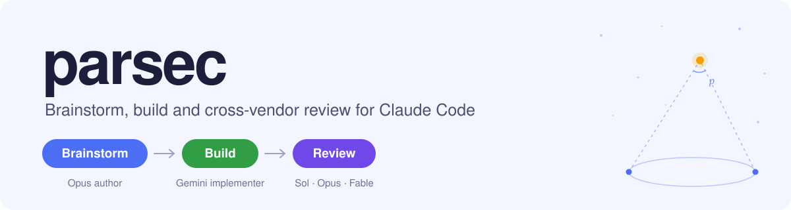
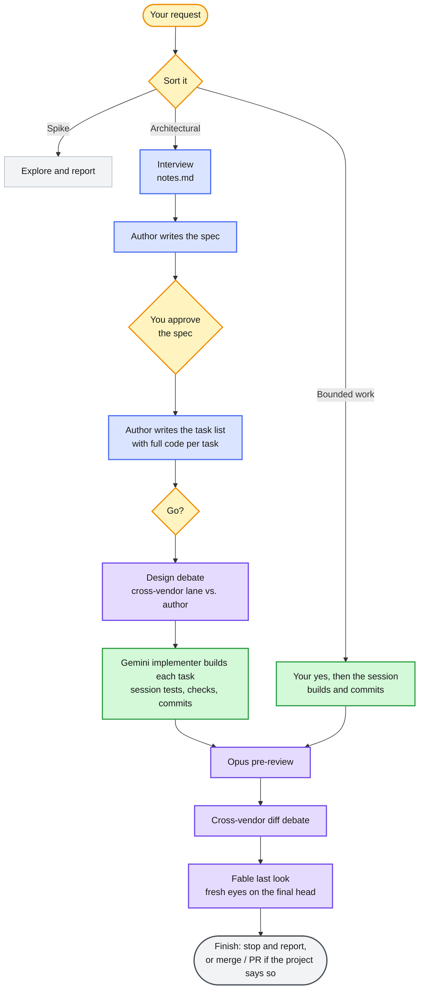

<div align="center">

<picture>
  <source media="(prefers-color-scheme: dark)" srcset=".github/assets/banner-dark.svg">
  
</picture>

An Opus author writes the plan. A fast Gemini implementer types the code.<br>
Models from three different companies check the work at the moments where a mistake gets expensive.


[](https://github.com/Bmwascher/parsec/actions/workflows/checks.yml)

[What it is](#what-it-is) · [Why](#why-it-exists) · [The flow](#how-a-feature-moves-through-it) · [Who does what](#who-does-what) · [Install](#install) · [Setup](#set-up-a-project) · [Everyday use](#everyday-use) · [Reviews](#how-a-review-works) · [On disk](#what-it-writes-to-disk) · [The tool](#the-tool) · [Safety rails](#safety-rails) · [Contributing](#working-on-parsec-itself)

</div>

---

## What it is

parsec is a [Claude Code](https://claude.com/claude-code) plugin that takes a feature from a rough idea to reviewed, committed code, in three stages:

| Stage | Who | What happens |
|---|---|---|
|  | Opus author | It interviews you, then writes a spec and a step-by-step task list with the real code in every step. |
|  | Gemini implementer | Types each task into the codebase. Your session runs the tests, checks the diff and makes the commit. |
|  | Sol, Opus, Fable | Before you commit to something, a model from a *different company* reads the work cold and argues with it until the findings are settled. |

Five skills carry the rules. One Python file, `tools/parsec.py`, does the mechanical work: it packages review rounds, launches the other companies' command-line tools and records every verdict.

> [!NOTE]
> parsec replaces two earlier plugins, superpowers and parallax. It keeps what they did well and drops the rest. The guiding rule of the rebuild: *prefer deleting to simplifying, because a simplified component is still a component.*

---

## Why it exists

A model that reviews its own work tends to agree with itself. A model from another company was trained differently, so it misses different things and catches different things. parsec puts that second opinion exactly where it pays off:

| Checkpoint | Why it pays |
|---|---|
| **Before the build** | A flaw in the plan is still cheap to fix. |
| **After the build** | A flaw in the diff hasn't reached the main branch yet. |

> [!TIP]
> **Thinking is split from typing.** The expensive model decides everything and writes the code into the plan. A cheap, fast model only transcribes it. When a transcription goes wrong, the tool can tell, and the task moves to the backup implementer, an Opus agent.

---

## How a feature moves through it

Every request is sorted first, and it can only ever get heavier, never lighter.

| Kind | What it is | What happens |
|---|---|---|
| **Spike** | Exploration with nothing to keep | No folder, no spec, no review. You hear what was learned. |
| **Bounded work** | A fix, a rename, a guard: small enough to need no plan | Your "yes" is the go. The session builds and commits it, then runs the review gate. |
| **Architectural** | Everything else | The full flow below. |




> [!IMPORTANT]
> **The one hard stop is the go.** Nothing is built until you say it, and approving the spec is not the same as a go. A pre-approved handoff counts as one.

**The finish is "stop and report"** unless you, the handoff or the project's own rules say to merge or open a pull request. The report lists every open minor finding, every point the driver refuted and every round closed early, so nothing decided on your behalf is silently dropped.

---

## Who does what

The roles below are in the order they meet the work.

- A **seat** is a job done by a Claude agent inside Claude Code. Its model lives in the agent file under [`agents/`](agents/).
- A **lane** is a model from another tool that parsec launches from the command line. Lanes live in [`lanes.toml`](lanes.toml).

### Driver


The driver is your session itself, so every flow starts here. It sorts the request, runs the tool, dispatches every other seat, checks each reviewer's claims against the code, runs the tests and makes every commit. It posts a summary after each round without waiting to be asked.

### Author


Writes the spec, then the task list with the full test and implementation code in every task. In a debate it answers each design finding with an edit or a refutation backed by evidence. When a review finds a blocking defect after the build, it writes the fix task.

### Implementers

The implementers build the tasks the author wrote. Whichever one builds a task, the driver runs its tests, checks the diff and makes the commit.

#### Primary: the Gemini lane


Builds every task by typing its code exactly as written. It decides nothing, so a wrong task shows up as a failed test, never as a quiet workaround.

#### Secondary: the backup implementer


Takes the tasks Gemini can't:

- a task that deletes, renames or moves a file, since Gemini's print mode has no delete tool;
- a task Gemini got wrong once;
- every task, when `agy` isn't installed.

### Reviewers

Reviewers never touch the code. Each one reads a package, reports findings graded Critical, Important or Minor, and ends with a verdict.

#### Pre-review


Opens the diff gate after the build. It catches the obvious before any cross-vendor quota is spent.

#### Cross-vendor reviewers

These are the reviewers from other companies. They run the design debate before the build and the diff debate after it.

| Rank | Lane | Model | When it runs |
|---|---|---|---|
| **Primary** | `sol` |  | Every debate, unless you name another lane |
| **Secondary** | `astra` |  | When you say "use Astra", or when the project's config makes it the default |
| **Backup** | `kimi` |  | Only when codex is unavailable and you approve, or the config approves it in advance |

#### Last look


A fresh agent that reads the final head once every other review has passed. Its PASS names the exact commit that ships. The same seat also sits on panels, answers polls and gives advice when two positions need an outside view.

> [!TIP]
> Model notes in [`models/`](models/) record what each model and CLI actually does, each fact dated or marked UNMEASURED. Swapping a model means re-deciding its effort level from that model's own guide, because "high" doesn't mean the same amount of thinking across companies.

---

## Install

### What you need

| Tool | Why | Required? |
|---|---|---|
| [Claude Code](https://claude.com/claude-code) | Hosts the plugin | ✅ Yes |
| Python 3.12 | Runs `tools/parsec.py` | ✅ Yes |
| Git | Worktrees, diffs, commits | ✅ Yes |
| PowerShell 7 | Every shell step (never Windows PowerShell 5.1) | ✅ Yes, on Windows |
| `codex` CLI, logged in | The Sol and Astra lanes | ✅ Yes, for cross-vendor review |
| `agy` CLI, logged in | The implementer (Gemini lane) | ➖ No. Without it, every task goes to the backup implementer. |
| `kimi` CLI, logged in | The Kimi backup lane | ➖ No |

### Add the plugin

From a terminal:

```powershell
claude plugin marketplace add Bmwascher/parsec
claude plugin install parsec@parsec
```

The repository is private, so this needs git access to it through a logged-in `gh` or saved git credentials. To install from a local clone instead, give the folder path:

```powershell
claude plugin marketplace add C:\Users\Brandon\Documents\parsec
claude plugin install parsec@parsec
```

Restart Claude Code afterwards so the skills load.

### Check it

```text
/parsec:doctor
```

The first line compares the installed copy with the repository head. If it says anything but `ok`, the plugin cache is stale; see [Releasing](#releasing). `/parsec:doctor update` runs each CLI's own update command once and names every lane it serves.

<details>
<summary><b>What a healthy result looks like</b></summary>

```text
plugin install: 0.1.6 at 1c8b5e9d: ok
lane astra: gpt-6-astra effort high   codex-cli 0.156.0   Logged in using ChatGPT
lane sol: gpt-6-sol effort high   codex-cli 0.156.0   Logged in using ChatGPT
lane kimi: kimi-code/k3 effort lane home   0.43.1   credentials present in the lane home
lane gemini: gemini-3.8-flash-high effort the model   1.2.5   login: the first run's log
```

</details>

---

## Set up a project

Each project answers once. Say **"set up parsec"**, or run any parsec step and the tool will say *run setup first*.

1. The `setup` skill scans the repository.
2. It shows **one proposed config** with the evidence behind every guess.
3. You correct it by exception. Nothing is written until you confirm.

The config lives in the **primary checkout** at `.claude/parsec.toml` and is always read from there, never from a worktree's stale copy. Only `docs_root` and `worktrees` are required.

<details>
<summary><b>A full example config</b></summary>

```toml
# .claude/parsec.toml
docs_root = "dev/docs/parsec"                                # where feature folders go
worktrees = "C:/Users/Brandon/Documents/KitnDev/_worktrees"  # where worktrees go

[reviewer]                       # optional; these are the defaults
codex_lane        = "sol"        # or "astra"
kimi_substitution = "ask"        # or "approved"

[[context]]                      # the reviewer's rubric, read first
path     = "AGENTS.md"
role     = "rubric"
sections = ["Performance", "Verification"]

[[context]]                      # look up and cite, never required reading
path = ".wow-api-reference"
role = "lookup"

[[context]]                      # reference code, named per round
path = "References"
role = "reference-code"
```

</details>

> [!IMPORTANT]
> The config holds only what the tool reads as data. Your project's gates, test policy, commit style, merge rules and smoke checks stay as prose in the project's own `AGENTS.md` or `CLAUDE.md`. **The project's rules always outrank parsec's.**

Run setup again after moving the project folder or resetting the PC, since absolute paths may change.

---

## Everyday use

You talk to it in plain words, and the skills trigger on what you say.

| You say | What runs |
|---|---|
| "Brainstorm a keybind export feature" / "plan" | `brainstorm`: sort the request, interview, spec, task list |
| "Go" | Records the go; the design debate runs, then `build` |
| "Fix the nil check in the timer" | Bounded work: build, commit, then the diff gate |
| "Get a cross-vendor review of this branch" | `debate` on the files or branch you name |
| "Run a panel on whether to split this module" | `panel`: two or more lanes answer one question blind |
| "Poll Fable" | One Fable second opinion, answered in chat |
| "Use Astra" | The Astra lane instead of Sol for that debate |
| "Use fast" | Priority service for that one debate only |
| `/parsec:doctor` | The health table |

Every long step runs **in the background with a readable name**, so you can see what's happening at a glance. After each review round, the session posts a short summary without waiting for you:

```text
Sol R2 Design Round: FIX   (7 min, resumed)
Critical 0, Important 2, Minor 1. Round 1's three findings: 2 closed, 1 still open.
| # | Severity | Finding | My answer |
Next: author edits, then round 3.
```

<details>
<summary><b>The background task names you'll see</b></summary>

```text
Pre-flight: Sol
Author: spec
Sol R1 Design Round
Task 3 Implement
Opus Pre-Review
Sol R2 Diff Round
Fable Last Look
```

</details>

> [!NOTE]
> Anything you need to read to make a decision comes to you in chat or on a published page, never as a Markdown file attachment. Markdown files don't open on a phone.

---

## How a review works

A **round** is one reviewer reading one package and returning one verdict. A **debate** is a series of rounds on the same question until it settles.

### Verdicts and severity

| Verdict | Meaning |
|---|---|
|  | No Critical or Important finding is open |
|  | Something must change; the reply names what |
|  | A decision only you can make |
|  | No verdict came back: a crash, a refusal or a quota wall |

| Severity | Costs another round? |
|---|---|
|  | Yes |
|  | Yes |
|  | Never. It's fixed or recorded, then the debate closes. |

Wording-only findings never cost a round either. Code defects matter most, then tests, and quota is never spent on prose.

### The rules of a debate

- **Every finding gets an answer:** a fix, a refutation with cited evidence, or an escalation to you. Silence is not an answer.
- **A refutation needs proof.** The driver checks it against the source before it goes into the next brief. For a claim about a test, that can mean breaking the code in a scratch copy and showing the test fails.
- **A debate ends** on a round with no new Critical or Important finding and no contested point left open.
- **Five rounds is the cap.** After that the session pauses and asks you. A spent budget never counts as a pass.
- **A point contested twice** with evidence on both sides goes to you at once.
- **Reviewers keep their memory.** A codex lane is resumed each round and must answer a continuity question. If it can't, the next round starts fresh with its earlier replies attached as evidence.

### The diff gate

After the build, three reviewers look at the diff in order:

| Step | Reviewer | Its job |
|---|---|---|
| 1 |  | Catches the obvious before the cross-vendor quota is spent |
| 2 |  | Debates the diff to a settled verdict; Astra by name, Kimi only with approval |
| 3 |  | A *fresh* agent reviews the final head. The version bump is the last commit before it, so its PASS names the exact commit that ships. |

A blocking finding anywhere in the gate becomes a fix task, written by the author and built like any other task. Only the commit that the final PASS names is ever merged.

> [!WARNING]
> **A gate with no cross-vendor lane is degraded, never a PASS.** If codex is down and Kimi isn't approved, the round is recorded as degraded and the finish report says so.

### Panels and polls

- **A panel** asks two or more lanes the same question without letting them see each other, and at least one lane is always from another company. The host checks every claim against the repository and marks what it couldn't check as UNVERIFIED. A point raised by more than one lane is the strongest signal. A split between lanes is a reason to read the file, never a tie the host breaks by preference.
- **A poll** is lighter: one Fable second opinion, posted in chat, never a gate.

---

## What it writes to disk

Each feature gets one folder under the project's docs root, named `<MM-DD>-<topic>`. Four files sit loose in it:

| File | What it holds |
|---|---|
| `notes.md` | Your questions and answers, verbatim |
| `spec.md` | The plan: what the feature does and why |
| `tasks.md` | The task list, with full code in every task |
| `ledger.md` | The running record: base, go, rounds, tasks, finish |

The **ledger** is the feature's memory. Its head records the base commit once. The tool appends one line per round, amendment and build, and never parses a line it didn't write. A failed attempt is never overwritten: it's renamed `.dead1`, `.dead2` and so on, so the evidence survives.

<details>
<summary><b>The full folder tree</b></summary>

```text
dev/docs/parsec/
├── 09-22-keybind-export/
│   ├── notes.md
│   ├── spec.md
│   ├── tasks.md
│   ├── ledger.md
│   ├── rounds/
│   │   ├── design-r1-sol/     brief.md, reply.md, record.json
│   │   ├── prereview-r1-opus/
│   │   ├── diff-r1-sol/
│   │   └── lastlook-r1-fable/
│   ├── build/
│   │   ├── task-01-brief.md   the exact slice Gemini received
│   │   ├── task-01-report.md  what the tool saw
│   │   └── task-01-agy.log
│   └── pages/            published pages, when a question is clearer shown
└── panels/
    └── 09-22-split-module/    panels about no feature
```

</details>

<details>
<summary><b>A sample ledger</b></summary>

```text
# Keybind export (2026)
topic: keybind-export   branch: feature/keybind-export   base: 3f2a91c
checkout: C:/.../_worktrees/KitnEssentials-keybind-export (made by build)
- 14:02 go: Brandon, "go"
- 14:31 task 01: 8c1d0e2, gemini, tests: green
```

</details>

> [!CAUTION]
> If git tracks your docs root, don't commit round folders while a debate or panel is still open. Replies committed into the reviewed tree once let a later reviewer read what an earlier one said, which ended the panel's blindness.

---

## The tool

`tools/parsec.py` is one Python file, kept at or under 1,000 lines by a test. The skills call it, so you rarely need to. Every subcommand has `--help`, and exit code `64` means a usage or setup error, such as a missing config or an unknown lane.

| Command | What it does |
|---|---|
| `round run` | Packages a round and runs it on a CLI lane (Sol, Astra, Kimi) in a clean review worktree |
| `round prepare` | Packages a round for an in-session seat (Opus, Fable) and prints the dispatch details |
| `round collect` | Finishes a pending round, or marks it degraded or closed on Minor |
| `round close` | Removes the feature's review worktrees |
| `verify` | Checks `spec.md` and `tasks.md` against the newest design record or amendment |
| `task-brief` | Slices task N into its own brief and prints its SHA-256 |
| `build run` | Runs task N through the implementer (Gemini) in the checkout and writes the task report |
| `build archive` | Renames task N's report and log to `.dead<k>` before a retry |
| `remove-worktree` | Removes a review worktree, unlinking junctions first so nothing real is deleted |
| `doctor` | The health table, one lane's pre-flight (`--lane`), or the updates (`--update`) |

---

## Safety rails

Each rail exists because its failure happened at least once. The dates live in the model notes and the changelog.


| The rail | The failure it prevents |
|---|---|
| The pre-flight checks the lane is installed, logged in and has quota, and that every rubric file and section exists | A round spent on a setup that could never answer |
| A brief is written with a file tool, never through a shell, and copied into the package byte for byte | A shell heredoc once stripped every apostrophe and backtick while every check still passed |


| The rail | The failure it prevents |
|---|---|
| `build run` refuses any other checkout, a checkout with uncommitted changes, and a base that isn't the expected commit | A run once transcribed its edits exactly, onto a checkout one commit too early |
| A task that flipped a file's line endings fails | A whole-file change that hides the real edit in the diff |
| The tool reads the task's success test, never Gemini's exit code | Gemini has reported success on runs that failed |
| Deletes, renames and moves go straight to the backup implementer | Gemini's print mode has no delete tool |
| A second failed attempt at the same task, for any reason, goes to you | A retry loop that burns quota on a task that's wrong |


| The rail | The failure it prevents |
|---|---|
| Review worktrees are removed links-first | A plain recursive delete following a `References` or docs junction into the real files |
| `build` removes only a worktree it made itself, and never when it stops to report | Deleting a checkout you handed it |

---

## Working on parsec itself

### Run the checks

```powershell
python -m pytest evals/tests -q
python evals/tools/check_changelog.py
```

CI runs both on every push, on Windows, because the tool's junction, process-kill and path rules are Windows rules.

### Budgets are tests

The plugin stays lean because its size limits fail the build. An addition that would pass a budget deletes something first.

| What | Limit |
|---|---|
| `tools/parsec.py` | 1,000 lines |
| All tests | 1,500 lines |
| The frozen checkers | 522 lines |
| All skill, template, agent and model prose | 10,000 words |
| Any one skill | 1,600 words |

### House rules

- **Every guard must name the failure it prevents.** No speculative safety.
- **Skills name the tool** as `${CLAUDE_PLUGIN_ROOT}/tools/parsec.py`, never a bare path. An old cached copy once ran instead of the current one.
- **Stage files by explicit path.** The family git hook blocks `git add -A`.
- **Frozen copies stay frozen.** The two checkers, their allow list, their tests, `lanes/kimi-reviewer.md` and `LICENSE` are byte-for-byte copies from the old repository. Don't tidy them.
- **Python 3.12 and PowerShell 7 only.**

### Releasing

The plugin cache is keyed on the version string, so a missed bump means a stale install.

1. Add a `## vX.Y.Z (date)` section at the top of [`CHANGELOG.md`](CHANGELOG.md), written in plain STE-checked English.
2. Bump `version` in [`.claude-plugin/plugin.json`](.claude-plugin/plugin.json) as the **last commit before the Fable last look**.
3. After the merge to `main`, the release workflow tags the version and publishes its changelog section. A push that doesn't change the version releases nothing.
4. Refresh and update the local install, then confirm with `/parsec:doctor` that the installed commit matches the repository head:

   ```powershell
   claude plugin marketplace update parsec
   claude plugin update parsec@parsec
   ```

<details>
<summary><b>Repository layout</b></summary>

```text
parsec/
├── .claude-plugin/     plugin.json and marketplace.json
├── .github/            CI, the release workflow, README images
├── agents/             the four Claude seats: author, backup-implementer, reviewer-opus, reviewer-fable
├── commands/           /parsec:doctor
├── skills/             brainstorm, build, debate, panel, setup
├── templates/          spec, task list, ledger, briefs, driver rules, the backup implementer's contract
├── models/             dated notes on each model and CLI
├── lanes/              the Kimi reviewer's agent file
├── tools/parsec.py     the one tool
├── evals/              tests, the fake CLI, the STE and changelog checkers
├── lanes.toml          the CLI lanes: model, effort, command, update
├── CHANGELOG.md
├── CLAUDE.md           gotchas for working in this repo
└── LICENSE             MIT
```

</details>

---

<div align="center">

MIT © 2026 Brandon Wascher

</div>
